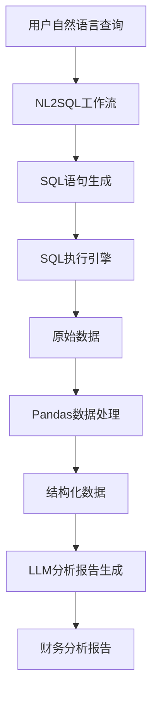

# SQL2Data工作流使用指南

## 概述

SQL2Data工作流是一个完整的数据分析解决方案，它可以：

1. **自然语言转SQL**：将用户的自然语言查询转换为SQL语句
2. **数据查询执行**：执行生成的SQL语句获取数据
3. **数据处理分析**：使用pandas处理和分析数据
4. **智能报告生成**：使用LLM生成专业的财务分析报告

## 系统架构



## 功能特性

### 🔄 NL2SQL转换
- 支持中文自然语言查询
- 智能识别涉及的数据表
- 自动生成优化的SQL语句
- SQL语法验证和错误处理

### 📊 数据处理
- 使用pandas进行高效数据处理
- 自动统计分析（描述性统计、分布分析等）
- 数据类型识别和转换
- 时间序列数据分析

### 🤖 智能分析
- 基于LLM的专业财务分析
- 自动识别关键指标和趋势
- 风险识别和建议措施
- 结构化的分析报告格式

## 环境要求

### 依赖包
```bash
# 核心框架
fastapi>=0.104.0
uvicorn[standard]>=0.24.0

# 数据库
asyncpg>=0.29.0
psycopg2-binary>=2.9.0

# 数据处理
pandas>=2.1.0

# AI和工作流
langgraph>=0.0.60
langchain>=0.1.0

# 其他依赖
pydantic>=2.5.0
httpx>=0.25.0
```

### 数据库配置
确保PostgreSQL数据库配置正确：
```env
PSQL_DB_HOST=localhost
PSQL_DB_PORT=5432
PSQL_DB_NAME=your_database
PSQL_DB_USER=your_user
PSQL_DB_PASSWORD=your_password
```

## 使用方法

### 1. API接口调用

#### 财务分析报告API
```http
POST /api/v1/workflows/financial-analysis
Content-Type: application/json

{
    "query": "请分析能源事业中心2025年1-4月的损益情况"
}
```

#### 响应格式
```json
{
    "success": true,
    "message": "财务分析报告生成成功",
    "data": {
        "query": "请分析能源事业中心2025年1-4月的损益情况",
        "sql_count": 2,
        "data_count": 150,
        "analysis_report": "# 财务分析报告\n\n## 数据概览\n...",
        "sql_list": [
            "SELECT * FROM fact_profit WHERE...",
            "SELECT * FROM fact_revenue WHERE..."
        ]
    }
}
```

### 2. 编程接口调用

#### 简单调用
```python
from app.workflows.langgraph.sql2data import generate_financial_analysis_report

# 异步调用
result = await generate_financial_analysis_report("查询2025年第一季度的收入情况")

if result.get('success'):
    print("分析报告：")
    print(result.get('analysis_report'))
else:
    print("错误：", result.get('error'))
```

#### 高级调用
```python
from app.workflows.langgraph.sql2data import SQL2DataWorkflow

# 创建工作流实例
workflow = SQL2DataWorkflow("请分析各部门的费用分布情况")

# 执行工作流
result = await workflow.execute_async({})

# 处理结果
if result.get('success'):
    print(f"生成了 {len(result.get('sql_list', []))} 个SQL语句")
    print(f"处理了 {result.get('raw_data_count', 0)} 行数据")
    print("分析报告：", result.get('analysis_report'))
```

### 3. 直接使用组件

#### 手动指定SQL
```python
from app.workflows.langgraph.sql2data import DataAnalysisState, compiled_data_workflow

# 创建初始状态
initial_state = DataAnalysisState(
    query="手动数据分析",
    sql_list=[
        "SELECT department, SUM(amount) FROM expenses GROUP BY department",
        "SELECT month, SUM(revenue) FROM revenue_table GROUP BY month"
    ]
)

# 执行数据分析工作流
result = await compiled_data_workflow.ainvoke(initial_state)

# 获取结果
if not result.error_message:
    print("数据处理成功")
    print("分析报告：", result.analysis_report)
```

## 查询示例

### 财务分析查询
```python
queries = [
    "分析2025年第一季度的利润情况",
    "对比各部门的费用支出情况",
    "查看能源事业中心的收入趋势",
    "评估公司整体财务健康状况",
    "分析各产品线的盈利能力"
]

for query in queries:
    result = await generate_financial_analysis_report(query)
    print(f"查询：{query}")
    print(f"结果：{result.get('success')}")
```

### 数据探索查询
```python
exploration_queries = [
    "数据库中有哪些表格？",
    "各个表的数据量是多少？",
    "最近一个月的数据更新情况",
    "数据质量检查和异常值分析"
]
```

## 测试和验证

### 运行测试脚本
```bash
cd AIPlatform
python test_sql2data_workflow.py
```

### 测试覆盖
- ✅ 数据库连接测试
- ✅ SQL执行测试  
- ✅ Pandas数据处理测试
- ✅ 工作流集成测试
- ✅ 分析报告生成测试

## 常见问题

### Q1: SQL生成失败
**问题**：NL2SQL无法生成有效的SQL语句

**解决方案**：
1. 检查查询语言是否清晰明确
2. 确认数据库表结构信息是否完整
3. 验证LLM模型是否正常运行

### Q2: 数据库连接失败
**问题**：无法连接到PostgreSQL数据库

**解决方案**：
1. 检查数据库服务是否启动
2. 验证连接配置参数
3. 确认网络连接和防火墙设置

### Q3: 分析报告质量不佳
**问题**：生成的分析报告不够专业或准确

**解决方案**：
1. 优化提示词模板
2. 增加更多的数据预处理
3. 调整LLM模型参数

### Q4: 性能问题
**问题**：大数据量处理时性能较慢

**解决方案**：
1. 优化SQL查询语句
2. 增加数据分页处理
3. 使用数据采样方法
4. 配置更高性能的硬件

## 扩展功能

### 自定义分析模板
```python
# 创建自定义分析提示词
custom_prompt = """
你是一位专业的财务分析师，专门分析{industry}行业的财务数据。
请重点关注以下指标：
1. 营收增长率
2. 利润率变化
3. 成本控制效果
4. 现金流状况
...
"""

# 在工作流中使用自定义模板
# （需要修改generate_analysis_report函数）
```

### 批量分析处理
```python
async def batch_analysis(queries):
    """批量处理多个查询"""
    results = []
    for query in queries:
        result = await generate_financial_analysis_report(query)
        results.append(result)
    return results

# 使用示例
batch_queries = [
    "分析Q1财务状况",
    "分析Q2财务状况", 
    "分析Q3财务状况",
    "分析Q4财务状况"
]

batch_results = await batch_analysis(batch_queries)
```

### 报告导出功能
```python
def export_report(report_content, format="markdown"):
    """导出分析报告"""
    if format == "markdown":
        with open("financial_report.md", "w", encoding="utf-8") as f:
            f.write(report_content)
    elif format == "pdf":
        # 使用报告生成库（如reportlab）
        pass
    elif format == "excel":
        # 使用pandas导出到Excel
        pass
```

## 最佳实践

### 1. 查询优化
- 使用具体明确的查询语言
- 指定时间范围和数据范围
- 避免过于复杂的复合查询

### 2. 性能优化
- 合理设置数据库连接池
- 使用数据缓存机制
- 对大型数据集进行分页处理

### 3. 安全考虑
- 验证用户输入
- 限制SQL执行权限
- 实施数据访问控制

### 4. 监控和日志
- 记录工作流执行日志
- 监控系统性能指标
- 设置异常告警机制

## 技术支持

如有问题，请：
1. 查看系统日志
2. 运行测试脚本诊断
3. 联系技术支持团队

---

**作者**: malou  
**创建时间**: 2025-01-08  
**版本**: 1.0.0 