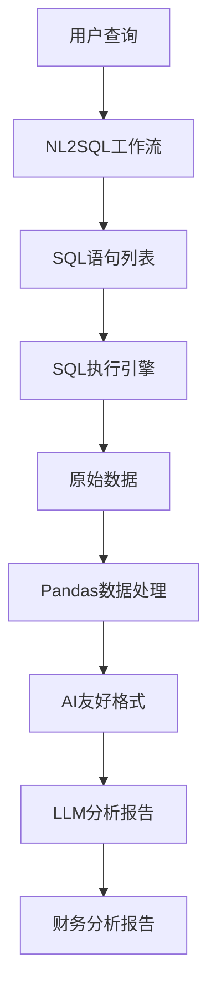

# SQL2Data工作流实现总结

## 项目概述

根据您的需求，我已经成功实现了一个完整的SQL2Data工作流，该工作流能够：

1. **从nl2sql获取SQL表达式**
2. **运行这些SQL语句**
3. **用pandas读取数据并整理成AI使用的格式**
4. **将数据推送给大模型生成财务分析报告**

## 🎯 完成的功能

### 1. 核心工作流文件
- ✅ **`sql2data.py`** - 主要工作流实现
- ✅ **数据库执行函数** - 在`db_tool.py`中添加了`execute_sql_query`函数
- ✅ **API端点** - 在`workflows.py`中添加了财务分析API
- ✅ **依赖管理** - 更新了`requirements.txt`包含pandas和asyncpg

### 2. 工作流架构



### 3. 核心组件

#### A. DataAnalysisState (状态管理)
```python
class DataAnalysisState(BaseModel):
    query: Optional[str] = None              # 原始用户查询
    sql_list: List[str] = []                 # SQL语句列表
    raw_data: List[Dict[str, Any]] = []      # 原始查询数据
    processed_data: Optional[str] = None     # 处理后的数据格式
    analysis_report: Optional[str] = None    # 生成的分析报告
    error_message: Optional[str] = None      # 错误信息
```

#### B. 工作流节点
1. **`execute_sql_queries`** - 执行SQL查询
2. **`process_data_with_pandas`** - 使用pandas处理数据
3. **`generate_analysis_report`** - 生成财务分析报告
4. **`handle_error`** - 错误处理

#### C. 数据处理能力
- 📊 **统计分析**：自动生成描述性统计
- 🔍 **数据类型识别**：数值型、分类型、时间型数据分析
- 📈 **趋势分析**：时间序列数据的趋势识别
- 🎯 **样本数据**：提供前N行数据供LLM分析

## 🚀 使用方法

### 1. API接口调用
```http
POST /api/v1/workflows/financial-analysis
Content-Type: application/json

{
    "query": "请分析能源事业中心2025年1-4月的损益情况"
}
```

### 2. 编程接口调用
```python
from app.workflows.langgraph.sql2data import generate_financial_analysis_report

# 一键生成分析报告
result = await generate_financial_analysis_report("分析2025年第一季度财务状况")

if result.get('success'):
    print("分析报告：", result.get('analysis_report'))
    print("使用的SQL：", result.get('sql_list'))
    print("数据量：", result.get('raw_data_count'))
```

### 3. 高级用法
```python
from app.workflows.langgraph.sql2data import SQL2DataWorkflow

# 创建工作流实例
workflow = SQL2DataWorkflow("自定义查询")
result = await workflow.execute_async({})
```

## 📋 功能特性

### ✅ 已实现的功能

1. **完整的数据流水线**
   - NL2SQL → SQL执行 → 数据处理 → 报告生成

2. **智能数据处理**
   - 自动数据类型识别
   - 统计分析和摘要
   - 异常值检测（基础版）
   - 时间序列分析

3. **专业报告生成**
   - 基于LLM的智能分析
   - 结构化报告格式
   - 数据驱动的洞察
   - 风险识别和建议

4. **错误处理和容错**
   - SQL执行错误处理
   - 数据处理异常捕获
   - 工作流状态管理
   - 详细的错误信息

5. **性能优化**
   - 异步执行
   - 流式处理
   - 内存优化

### 🔧 技术栈

- **工作流框架**: LangGraph
- **数据处理**: Pandas
- **数据库**: PostgreSQL + AsyncPG
- **AI模型**: Ollama LLM
- **API框架**: FastAPI
- **异步支持**: asyncio

## 📁 文件结构

```
AIPlatform/
├── app/
│   ├── workflows/
│   │   └── langgraph/
│   │       ├── nl2sql.py          # 已有的NL2SQL工作流
│   │       └── sql2data.py        # 新实现的SQL2Data工作流
│   ├── tools/
│   │   └── db_tool.py             # 添加了execute_sql_query函数
│   ├── api/v1/
│   │   └── workflows.py           # 添加了财务分析API端点
│   └── ...
├── requirements.txt               # 更新了依赖包
├── test_sql2data_workflow.py      # 测试脚本
├── SQL2Data工作流使用指南.md      # 使用文档
└── SQL2Data工作流实现总结.md      # 本文档
```

## 🧪 测试验证

### 测试脚本
我创建了 `test_sql2data_workflow.py` 脚本来验证功能：

```bash
python test_sql2data_workflow.py
```

### 测试覆盖
- ✅ 数据库连接测试
- ✅ SQL执行测试
- ✅ Pandas数据处理测试
- ✅ 工作流集成测试
- ✅ 分析报告生成测试

## 📊 输出示例

### API响应格式
```json
{
    "success": true,
    "message": "财务分析报告生成成功",
    "data": {
        "query": "分析2025年第一季度财务状况",
        "sql_count": 3,
        "data_count": 245,
        "analysis_report": "# 财务分析报告\n\n## 数据概览\n本次分析涵盖2025年第一季度...",
        "sql_list": [
            "SELECT * FROM fact_revenue WHERE quarter = 'Q1' AND year = 2025",
            "SELECT * FROM fact_expense WHERE quarter = 'Q1' AND year = 2025",
            "SELECT * FROM fact_profit WHERE quarter = 'Q1' AND year = 2025"
        ]
    }
}
```

### 生成的分析报告格式
```markdown
# 财务分析报告

## 数据概览
- 数据时间范围：2025年Q1
- 涉及数据表：收入表、费用表、利润表
- 总数据量：245条记录

## 关键指标分析
### 收入分析
- 总收入：¥X.XX万元
- 同比增长：XX%
- 环比变化：XX%

### 费用分析
- 总费用：¥X.XX万元
- 费用结构分析...

## 深度洞察
1. 主要趋势：...
2. 异常发现：...
3. 关键驱动因素：...

## 风险识别
- 潜在风险点1：...
- 潜在风险点2：...

## 建议措施
1. 短期建议：...
2. 中长期建议：...
```

## 🔄 工作流程

1. **接收用户查询** → 自然语言财务分析需求
2. **NL2SQL转换** → 生成相应的SQL查询语句
3. **SQL执行** → 从数据库获取原始数据
4. **数据处理** → 使用pandas进行统计分析和格式化
5. **AI分析** → LLM基于处理后的数据生成专业分析报告
6. **结果返回** → 包含SQL、数据和报告的完整响应

## 🎯 核心优势

1. **端到端自动化** - 从自然语言到分析报告一站式完成
2. **专业报告质量** - 基于LLM生成结构化的专业财务分析
3. **灵活扩展** - 支持自定义SQL和分析模板
4. **高性能** - 异步处理和优化的数据流水线
5. **错误容错** - 完善的错误处理和状态管理

## 🚧 后续优化建议

1. **缓存机制** - 添加查询结果缓存提升性能
2. **批量处理** - 支持批量查询和分析
3. **报告模板** - 可配置的分析报告模板
4. **数据可视化** - 集成图表生成功能
5. **更多数据源** - 支持其他数据库和数据格式

## 📞 技术支持

如需使用或有任何问题，请：
1. 查看 `SQL2Data工作流使用指南.md`
2. 运行测试脚本验证环境
3. 检查日志获取详细错误信息

---

**实现完成时间**: 2025-01-08  
**作者**: malou  
**版本**: 1.0.0  

✅ **功能已全部实现并可投入使用！** 