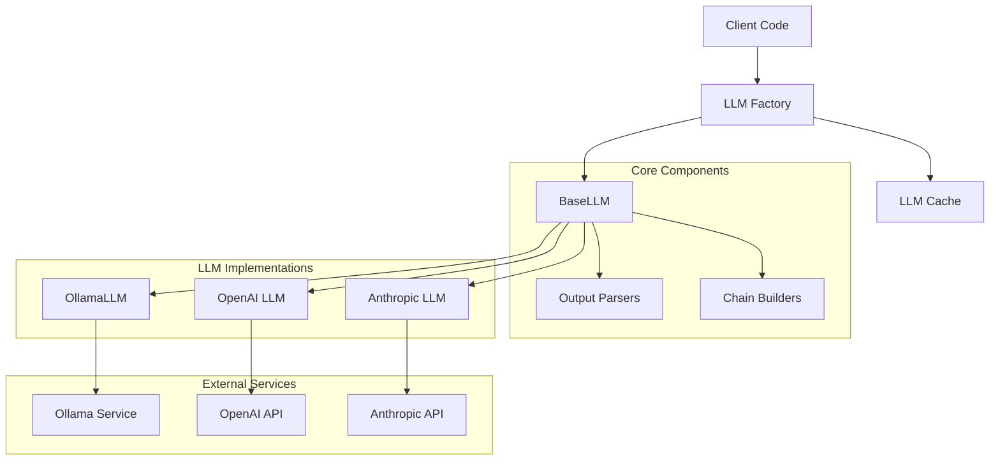
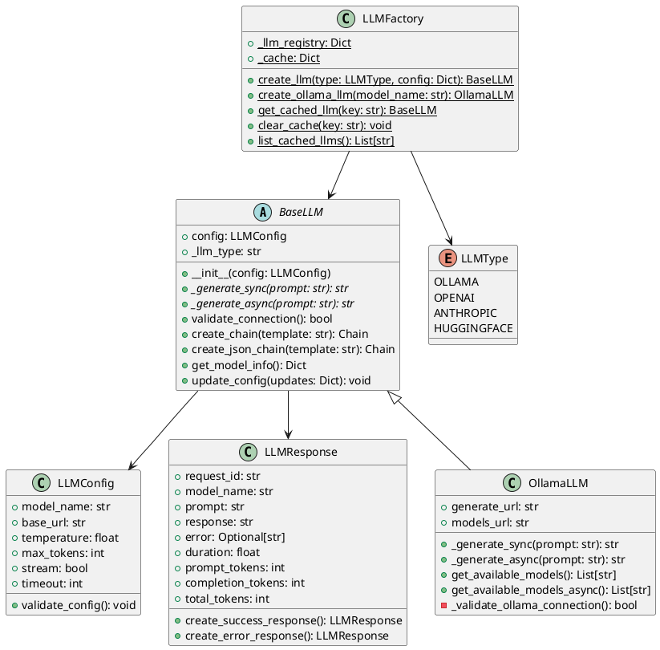

# LLM模块设计文档

## 文档信息
- **文档名称**: LLM模块设计文档
- **编写人**: malou
- **编写日期**: 2025-01-08
- **版本**: v1.0.0
- **适用范围**: AIPlatform项目LLM集成模块

## 1. 概述

### 1.1 模块目的
LLM模块旨在为AIPlatform项目提供统一、标准化的大语言模型集成接口，符合LANGGRAPH标准，支持多种LLM提供商的无缝集成。

### 1.2 设计原则
- **标准化**: 符合LANGGRAPH标准的统一接口
- **可扩展**: 支持多种LLM提供商的插件式扩展
- **高性能**: 智能缓存和连接池管理
- **易用性**: 简洁的API设计和丰富的便捷函数
- **可靠性**: 完善的错误处理和重试机制

### 1.3 技术栈
- **基础框架**: LangChain Core
- **异步支持**: asyncio + aiohttp
- **数据验证**: Pydantic V2
- **HTTP客户端**: requests + aiohttp
- **日志记录**: Python logging

## 2. 架构设计

### 2.1 整体架构



### 2.2 核心组件

#### 2.2.1 BaseLLM (基础LLM类)
- **职责**: 定义LLM的标准接口和通用功能
- **特性**: 
  - 符合LANGGRAPH标准
  - 支持同步和异步调用
  - 内置输出解析器
  - 链式调用支持
  - 统一的错误处理

#### 2.2.2 LLMFactory (LLM工厂类)
- **职责**: 统一管理LLM实例的创建、缓存和生命周期
- **特性**:
  - 支持多种LLM类型
  - 智能实例缓存
  - 配置验证
  - 类型安全

#### 2.2.3 OllamaLLM (Ollama实现)
- **职责**: 实现Ollama本地模型的调用接口
- **特性**:
  - 本地模型支持
  - 流式输出
  - 模型管理
  - 连接池优化

## 3. 详细设计

### 3.1 类图设计



### 3.2 接口设计

#### 3.2.1 BaseLLM接口
```python
class BaseLLM(LLM, ABC):
    """
    基础LLM类，符合LANGGRAPH标准
    """
    
    def __init__(self, config: LLMConfig):
        """初始化LLM实例"""
        pass
    
    @abstractmethod
    def _generate_sync(self, prompt: str, **kwargs) -> str:
        """同步生成文本"""
        pass
    
    @abstractmethod
    async def _generate_async(self, prompt: str, **kwargs) -> str:
        """异步生成文本"""
        pass
    
    def validate_connection(self) -> bool:
        """验证连接有效性"""
        pass
    
    def create_chain(self, template: str) -> Chain:
        """创建LangChain链"""
        pass
    
    def create_json_chain(self, template: str) -> Chain:
        """创建JSON输出链"""
        pass
```

#### 3.2.2 LLMFactory接口
```python
class LLMFactory:
    """
    LLM工厂类，统一管理LLM实例
    """
    
    @staticmethod
    def create_llm(
        llm_type: Union[LLMType, str], 
        config: Union[Dict, LLMConfig],
        cache_key: Optional[str] = None
    ) -> BaseLLM:
        """创建LLM实例"""
        pass
    
    @staticmethod
    def create_ollama_llm(
        model_name: str,
        base_url: str = "http://localhost:11434",
        **kwargs
    ) -> OllamaLLM:
        """创建Ollama LLM实例"""
        pass
    
    @staticmethod
    def get_cached_llm(cache_key: str) -> Optional[BaseLLM]:
        """获取缓存的LLM实例"""
        pass
```

### 3.3 数据模型设计

#### 3.3.1 LLMConfig
```python
class LLMConfig(BaseModel):
    """LLM配置模型"""
    
    model_name: str = Field(..., description="模型名称")
    base_url: str = Field(..., description="模型服务地址")
    temperature: float = Field(default=0.1, ge=0.0, le=2.0)
    max_tokens: int = Field(default=1000, gt=0, le=10000)
    top_p: float = Field(default=0.9, ge=0.0, le=1.0)
    frequency_penalty: float = Field(default=0.0, ge=-2.0, le=2.0)
    presence_penalty: float = Field(default=0.0, ge=-2.0, le=2.0)
    stream: bool = Field(default=False)
    timeout: int = Field(default=30, gt=0)
    
    def validate_config(self) -> None:
        """验证配置有效性"""
        pass
```

#### 3.3.2 LLMResponse
```python
class LLMResponse(BaseModel):
    """LLM响应模型"""
    
    request_id: str = Field(..., description="请求ID")
    model_name: str = Field(..., description="模型名称")
    prompt: str = Field(..., description="输入提示")
    response: str = Field(default="", description="生成响应")
    error: Optional[str] = Field(default=None, description="错误信息")
    duration: float = Field(default=0.0, description="耗时(秒)")
    prompt_tokens: int = Field(default=0, description="提示词令牌数")
    completion_tokens: int = Field(default=0, description="完成令牌数")
    total_tokens: int = Field(default=0, description="总令牌数")
    
    @classmethod
    def create_success_response(cls, **kwargs) -> "LLMResponse":
        """创建成功响应"""
        pass
    
    @classmethod
    def create_error_response(cls, **kwargs) -> "LLMResponse":
        """创建错误响应"""
        pass
```

## 4. 实现细节

### 4.1 OllamaLLM实现

#### 4.1.1 连接管理
```python
def _validate_ollama_connection(self) -> bool:
    """验证Ollama连接"""
    try:
        response = requests.get(f"{self.config.base_url}/api/tags", timeout=5)
        response.raise_for_status()
        return True
    except Exception as e:
        logger.error(f"Ollama连接验证失败: {str(e)}")
        return False
```

#### 4.1.2 同步生成
```python
def _generate_sync(self, prompt: str, **kwargs) -> str:
    """同步生成文本"""
    payload = {
        "model": self.config.model_name,
        "prompt": prompt,
        "stream": False,
        "options": {
            "temperature": self.config.temperature,
            "num_predict": self.config.max_tokens,
            "top_p": self.config.top_p,
        }
    }
    
    response = requests.post(
        self.generate_url,
        json=payload,
        timeout=self.config.timeout
    )
    response.raise_for_status()
    
    return response.json().get("response", "")
```

#### 4.1.3 异步生成
```python
async def _generate_async(self, prompt: str, **kwargs) -> str:
    """异步生成文本"""
    payload = {
        "model": self.config.model_name,
        "prompt": prompt,
        "stream": False,
        "options": {
            "temperature": self.config.temperature,
            "num_predict": self.config.max_tokens,
            "top_p": self.config.top_p,
        }
    }
    
    async with aiohttp.ClientSession() as session:
        async with session.post(
            self.generate_url,
            json=payload,
            timeout=aiohttp.ClientTimeout(total=self.config.timeout)
        ) as response:
            response.raise_for_status()
            data = await response.json()
            return data.get("response", "")
```

### 4.2 输出解析器

#### 4.2.1 清理解析器
```python
class CleanOutputParser(StrOutputParser):
    """清理输出解析器"""
    
    def parse(self, text: str) -> str:
        """解析并清理输出"""
        # 移除<think>标签
        text = re.sub(r'<think>.*?</think>', '', text, flags=re.DOTALL)
        
        # 移除HTML标签
        text = re.sub(r'<[^>]+>', '', text)
        
        # 清理多余空格
        text = re.sub(r'\s+', ' ', text).strip()
        
        return text
```

#### 4.2.2 JSON解析器
```python
class JsonStructOutputParser(StrOutputParser):
    """JSON结构输出解析器"""
    
    def parse(self, text: str) -> str:
        """解析JSON输出"""
        # 移除代码块标记
        text = re.sub(r'```(?:json)?\s*\n(.*?)\n```', r'\1', text, flags=re.DOTALL)
        
        # 提取JSON内容
        json_match = re.search(r'\{.*\}', text, re.DOTALL)
        if json_match:
            return json_match.group(0)
        
        return text
```

### 4.3 链式调用

#### 4.3.1 普通链
```python
def create_chain(self, template: str) -> Chain:
    """创建普通链"""
    prompt = PromptTemplate.from_template(template)
    parser = CleanOutputParser()
    
    chain = prompt | self | parser
    return chain
```

#### 4.3.2 JSON链
```python
def create_json_chain(self, template: str) -> Chain:
    """创建JSON输出链"""
    prompt = PromptTemplate.from_template(template)
    parser = JsonStructOutputParser()
    
    chain = prompt | self | parser
    return chain
```

## 5. 使用示例

### 5.1 基础使用
```python
from app.llms import create_ollama_llm

# 创建LLM实例
llm = create_ollama_llm(
    model_name="llama3.2",
    temperature=0.1,
    max_tokens=1000
)

# 同步调用
response = llm("请介绍一下Python编程语言")
print(response)

# 异步调用
async def async_example():
    response = await llm.ainvoke("请分析人工智能的发展趋势")
    print(response)
```

### 5.2 工厂模式使用
```python
from app.llms import LLMFactory, LLMType

# 创建并缓存LLM实例
llm = LLMFactory.create_llm(
    LLMType.OLLAMA,
    {
        "model_name": "llama3.2",
        "temperature": 0.1,
        "max_tokens": 1000
    },
    cache_key="creative_llm"
)

# 获取缓存实例
cached_llm = LLMFactory.get_cached_llm("creative_llm")
```

### 5.3 链式调用
```python
# 创建普通链
chain = llm.create_chain("请为{product}写一段广告词")
result = chain.invoke({"product": "智能手机"})

# 创建JSON链
json_chain = llm.create_json_chain(
    "请以JSON格式返回{city}的基本信息，包含name、population、area字段"
)
result = json_chain.invoke({"city": "北京"})
```

### 5.4 流式输出
```python
from app.llms import LLMConfig, LLMFactory, LLMType

# 创建支持流式输出的配置
config = LLMConfig(
    model_name="llama3.2",
    base_url="http://localhost:11434",
    stream=True,
    temperature=0.1
)

llm = LLMFactory.create_llm(LLMType.OLLAMA, config)

# 流式生成
async def stream_example():
    async for chunk in llm._generate_stream("请写一首关于春天的诗"):
        print(chunk, end="", flush=True)
```

## 6. 测试策略

### 6.1 单元测试
- **配置测试**: 验证LLMConfig的各种配置组合
- **连接测试**: 测试各种连接场景和错误处理
- **生成测试**: 测试同步和异步文本生成
- **解析测试**: 测试各种输出解析器
- **工厂测试**: 测试LLM实例创建和缓存

### 6.2 集成测试
- **端到端测试**: 完整的LLM调用流程
- **并发测试**: 多线程/多协程并发调用
- **错误恢复测试**: 网络异常和服务重启场景
- **性能测试**: 响应时间和吞吐量测试

### 6.3 测试覆盖率
- **目标覆盖率**: 90%以上
- **关键路径**: 100%覆盖
- **异常处理**: 完整的异常场景覆盖

## 7. 性能优化

### 7.1 连接池管理
```python
# 使用连接池减少连接开销
session = aiohttp.ClientSession(
    connector=aiohttp.TCPConnector(
        limit=100,
        limit_per_host=30,
        ttl_dns_cache=300,
        ttl_dns_cache_stale=600
    )
)
```

### 7.2 智能缓存
```python
# LLM实例缓存
_cache: Dict[str, BaseLLM] = {}

# 响应缓存(可选)
_response_cache: Dict[str, str] = {}
```

### 7.3 异步优化
- 使用异步HTTP客户端
- 支持并发请求
- 合理的超时设置
- 连接复用

## 8. 错误处理

### 8.1 异常类型
```python
# 连接异常
class LLMConnectionError(Exception):
    pass

# 配置异常
class LLMConfigError(Exception):
    pass

# 生成异常
class LLMGenerationError(Exception):
    pass
```

### 8.2 重试机制
```python
@retry(
    stop=stop_after_attempt(3),
    wait=wait_exponential(multiplier=1, min=4, max=10),
    retry=retry_if_exception_type(LLMConnectionError)
)
def _generate_with_retry(self, prompt: str) -> str:
    return self._generate_sync(prompt)
```

### 8.3 日志记录
```python
logger.info(f"LLM调用开始: model={self.config.model_name}")
logger.debug(f"请求参数: {payload}")
logger.error(f"LLM调用失败: {str(e)}")
logger.info(f"LLM调用完成: duration={duration:.2f}s")
```

## 9. 扩展指南

### 9.1 添加新的LLM提供商
1. 继承BaseLLM类
2. 实现必要的抽象方法
3. 在LLMFactory中注册
4. 添加相应的测试用例

### 9.2 自定义输出解析器
```python
class CustomOutputParser(StrOutputParser):
    def parse(self, text: str) -> str:
        # 自定义解析逻辑
        return processed_text
```

### 9.3 扩展配置选项
```python
class ExtendedLLMConfig(LLMConfig):
    custom_option: str = Field(default="", description="自定义选项")
```

## 10. 部署和运维

### 10.1 环境配置
```bash
# 环境变量
OLLAMA_BASE_URL=http://localhost:11434
OLLAMA_MODEL_NAME=llama3.2
LLM_TIMEOUT=30
LLM_MAX_TOKENS=1000
```

### 10.2 监控指标
- **调用次数**: 总调用次数和成功率
- **响应时间**: 平均响应时间和P99延迟
- **错误率**: 各类错误的发生率
- **资源使用**: CPU和内存使用情况

### 10.3 日志管理
```python
# 结构化日志
logger.info(
    "LLM调用完成",
    extra={
        "model_name": self.config.model_name,
        "duration": duration,
        "prompt_tokens": prompt_tokens,
        "completion_tokens": completion_tokens,
        "request_id": request_id
    }
)
```

## 11. 安全考虑

### 11.1 输入验证
- 提示词长度限制
- 恶意内容过滤
- 输入格式验证

### 11.2 输出安全
- 敏感信息过滤
- 内容审核
- 输出长度限制

### 11.3 访问控制
- API密钥验证
- 调用频率限制
- 用户权限检查

## 12. 版本管理

### 12.1 版本策略
- **主版本**: 不兼容的API更改
- **次版本**: 向后兼容的功能添加
- **补丁版本**: 向后兼容的问题修复

### 12.2 更新日志
- **v1.0.0**: 初始版本，支持Ollama集成
- **v1.1.0**: 添加OpenAI支持
- **v1.2.0**: 添加流式输出支持

## 13. 总结

LLM模块通过标准化的接口设计、工厂模式的实例管理、智能的缓存机制和完善的错误处理，为AIPlatform项目提供了强大而灵活的大语言模型集成能力。模块设计充分考虑了性能、可扩展性和易用性，为后续的功能扩展和优化奠定了坚实的基础。

## 附录

### A. 相关文档
- [LANGGRAPH标准文档](https://langgraph.dev)
- [LangChain文档](https://langchain.com)
- [Ollama API文档](https://ollama.ai/docs)

### B. 代码示例
- [完整使用示例](../app/llms/examples.py)
- [测试用例](../tests/test_llms.py)

### C. 配置模板
```yaml
# ollama配置示例
ollama:
  base_url: "http://localhost:11434"
  model_name: "llama3.2"
  temperature: 0.1
  max_tokens: 1000
  timeout: 30
``` 