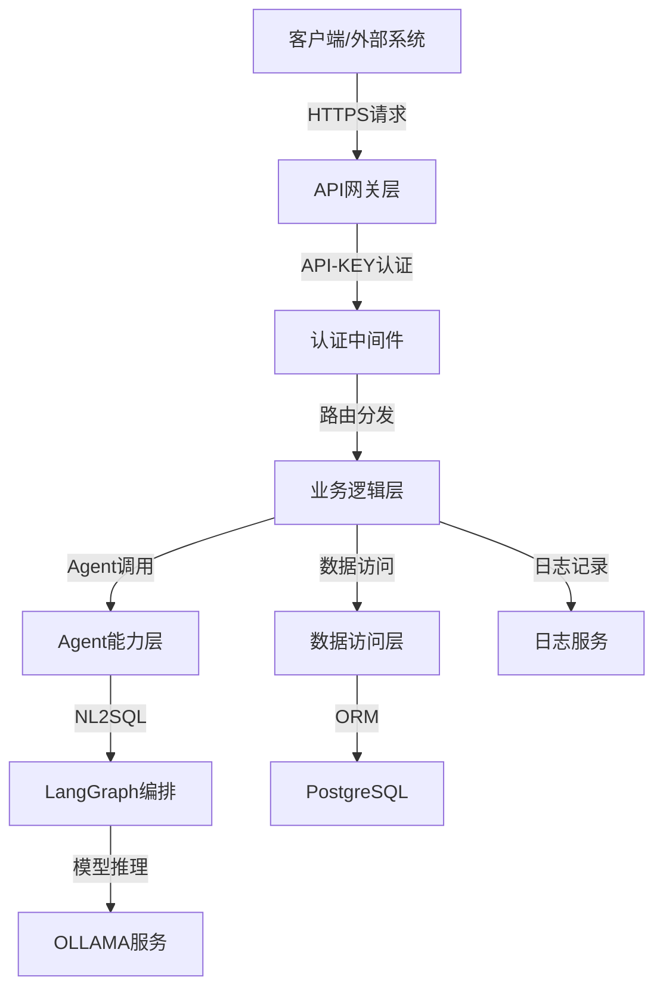
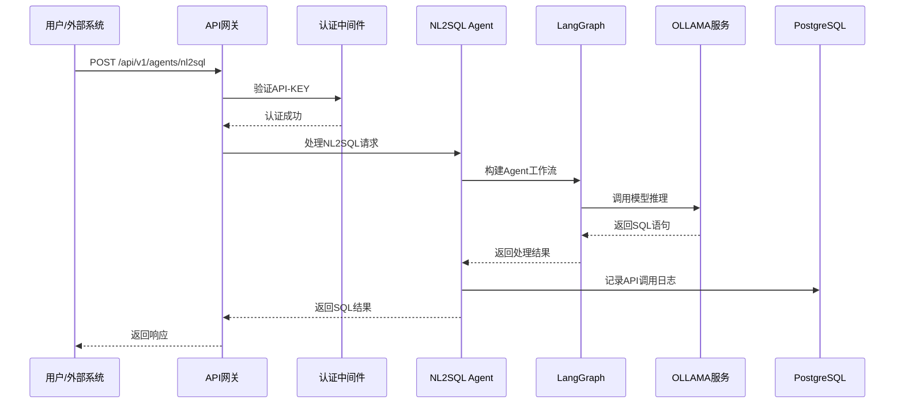
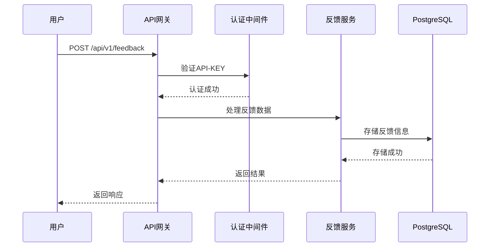

# 功能设计说明书

## 1. 文档信息
- 文档名称：功能设计说明书
- 编写人：malou
- 编写日期：2024-12-19
- 版本号：V1.0
- 修订记录：
  - 2024-12-19：初稿

## 2. 概述
### 2.1 文档目的
本功能设计说明书旨在详细描述AI API接口平台的功能模块、接口设计、数据结构、业务流程等，为开发团队提供详细的功能实现指导。

### 2.2 系统概述
AI API接口平台是一个基于FastAPI+LangGraph+OLLAMA+PostgreSQL技术栈构建的AI能力服务平台，为财务部门提供统一的AI API接口，支持自然语言转PSQL、反馈数据收集等核心功能，并具备良好的扩展性以支持未来新增AI能力。

### 2.3 目标用户
- **主要用户**：财务部门业务人员
- **次要用户**：其他部门需要AI能力的业务系统
- **管理用户**：平台管理员、技术运维人员

## 3. 系统架构概述
### 3.1 技术架构


### 3.2 模块划分
- **API网关模块**：统一入口、认证、路由、限流
- **认证管理模块**：API-KEY生成、验证、管理
- **Agent能力模块**：AI Agent能力实现和编排
- **数据管理模块**：数据存储、查询、管理
- **反馈收集模块**：用户反馈收集和分析
- **日志监控模块**：系统日志、监控、告警

## 4. 功能模块详细设计
### 4.1 API-KEY认证管理模块
#### 4.1.1 功能概述
提供API-KEY的全生命周期管理，包括生成、分发、验证、更新、失效等功能，确保API接口的安全访问。

#### 4.1.2 功能列表
- **API-KEY生成**：为用户生成唯一的API密钥
- **API-KEY验证**：验证请求中的API-KEY有效性
- **API-KEY管理**：查看、更新、禁用、删除API-KEY
- **权限控制**：基于API-KEY的权限管理和访问控制
- **使用统计**：API-KEY的使用次数、频率统计

#### 4.1.3 接口设计
**生成API-KEY接口**
```http
POST /api/v1/auth/keys
Content-Type: application/json
Authorization: Bearer {admin_token}

{
  "user_id": "user123",
  "name": "财务部查询密钥",
  "permissions": ["nl2sql", "feedback"],
  "expires_days": 365
}

Response:
{
  "code": 200,
  "message": "success",
  "data": {
    "key_id": "key_123",
    "key_value": "ak_1234567890abcdef",
    "name": "财务部查询密钥",
    "permissions": ["nl2sql", "feedback"],
    "expires_at": "2025-12-19T10:00:00Z",
    "created_at": "2024-12-19T10:00:00Z"
  }
}
```

**验证API-KEY接口（中间件）**
```http
GET /api/v1/agents/nl2sql
X-API-Key: ak_1234567890abcdef

Response:
{
  "code": 200,
  "message": "success",
  "data": {...}
}
```

### 4.2 自然语言转PSQL Agent模块
#### 4.2.1 功能概述
核心AI能力模块，接收用户的自然语言查询需求，通过LangGraph编排和OLLAMA模型推理，生成对应的PostgreSQL查询语句。

#### 4.2.2 功能列表
- **自然语言理解**：解析用户的自然语言查询意图
- **SQL生成**：基于OLLAMA模型生成PostgreSQL查询语句
- **语法验证**：验证生成的SQL语句语法正确性
- **安全检查**：防止SQL注入，限制危险操作
- **执行预览**：提供SQL执行预览和结果估算
- **历史记录**：保存查询历史和生成的SQL语句

#### 4.2.3 接口设计
**自然语言转SQL接口**
```http
POST /api/v1/agents/nl2sql
Content-Type: application/json
X-API-Key: ak_1234567890abcdef

{
  "query": "查询上个月销售额超过10万的客户信息",
  "database_schema": "finance_db",
  "context": {
    "user_id": "user123",
    "department": "finance"
  }
}

Response:
{
  "code": 200,
  "message": "success",
  "data": {
    "request_id": "req_123456",
    "sql": "SELECT customer_name, SUM(sales_amount) FROM sales WHERE sales_date >= '2024-11-01' AND sales_date < '2024-12-01' GROUP BY customer_name HAVING SUM(sales_amount) > 100000;",
    "explanation": "查询2024年11月份销售额超过10万元的客户姓名和总销售额",
    "confidence": 0.92,
    "execution_time": 1.5,
    "warnings": []
  }
}
```

### 4.3 OLLAMA模型集成模块
#### 4.3.1 功能概述
负责与OLLAMA模型服务的集成，提供模型推理能力，支持多种模型的调用和管理。

#### 4.3.2 功能列表
- **模型调用**：调用OLLAMA服务进行模型推理
- **模型管理**：查看可用模型列表、模型状态
- **负载均衡**：支持多个OLLAMA实例的负载均衡
- **连接池管理**：管理与OLLAMA服务的连接池
- **异常处理**：处理模型调用异常和重试机制

#### 4.3.3 接口设计
**获取可用模型列表**
```http
GET /api/v1/models
X-API-Key: ak_1234567890abcdef

Response:
{
  "code": 200,
  "message": "success",
  "data": {
    "models": [
      {
        "name": "llama3.2",
        "size": "8B",
        "status": "available",
        "description": "Meta Llama 3.2 8B模型"
      },
      {
        "name": "mistral",
        "size": "7B", 
        "status": "available",
        "description": "Mistral 7B模型"
      }
    ]
  }
}
```

### 4.4 反馈数据收集模块
#### 4.4.1 功能概述
收集用户对AI服务使用效果的反馈，包括生成SQL的正确性评价、使用体验反馈等，用于持续优化模型效果。

#### 4.4.2 功能列表
- **反馈提交**：用户提交对AI服务的使用反馈
- **反馈查询**：查询历史反馈记录
- **反馈分析**：统计分析反馈数据，生成改进建议
- **反馈导出**：导出反馈数据用于模型优化

#### 4.4.3 接口设计
**提交反馈接口**
```http
POST /api/v1/feedback
Content-Type: application/json
X-API-Key: ak_1234567890abcdef

{
  "request_id": "req_123456",
  "rating": 4,
  "is_sql_correct": true,
  "feedback_text": "生成的SQL语句正确，查询结果符合预期",
  "suggestions": "希望能够支持更复杂的聚合查询"
}

Response:
{
  "code": 200,
  "message": "success",
  "data": {
    "feedback_id": "fb_789012",
    "created_at": "2024-12-19T10:00:00Z"
  }
}
```

### 4.5 用户管理模块
#### 4.5.1 功能概述
管理平台用户信息，包括用户注册、信息维护、权限分配等功能。

#### 4.5.2 功能列表
- **用户注册**：新用户注册和信息录入
- **用户信息管理**：查看、更新用户基本信息
- **权限管理**：分配和管理用户权限
- **使用统计**：统计用户API使用情况

#### 4.5.3 接口设计
**用户信息查询**
```http
GET /api/v1/users/{user_id}
X-API-Key: ak_1234567890abcdef

Response:
{
  "code": 200,
  "message": "success",
  "data": {
    "user_id": "user123",
    "name": "张三",
    "email": "zhangsan@company.com",
    "department": "finance",
    "created_at": "2024-01-01T00:00:00Z",
    "last_login": "2024-12-19T09:00:00Z"
  }
}
```

## 5. 数据库设计
### 5.1 数据表结构
#### 5.1.1 用户表（users）
```sql
CREATE TABLE users (
    id UUID PRIMARY KEY DEFAULT gen_random_uuid(),
    name VARCHAR(100) NOT NULL,
    email VARCHAR(255) UNIQUE NOT NULL,
    department VARCHAR(50),
    status VARCHAR(20) DEFAULT 'active',
    created_at TIMESTAMP DEFAULT CURRENT_TIMESTAMP,
    updated_at TIMESTAMP DEFAULT CURRENT_TIMESTAMP
);
```

#### 5.1.2 API密钥表（api_keys）
```sql
CREATE TABLE api_keys (
    id UUID PRIMARY KEY DEFAULT gen_random_uuid(),
    user_id UUID REFERENCES users(id),
    key_value VARCHAR(255) UNIQUE NOT NULL,
    name VARCHAR(100),
    permissions JSONB,
    expires_at TIMESTAMP,
    is_active BOOLEAN DEFAULT true,
    created_at TIMESTAMP DEFAULT CURRENT_TIMESTAMP,
    last_used_at TIMESTAMP
);
```

#### 5.1.3 Agent配置表（agents）
```sql
CREATE TABLE agents (
    id UUID PRIMARY KEY DEFAULT gen_random_uuid(),
    name VARCHAR(100) NOT NULL,
    type VARCHAR(50) NOT NULL,
    description TEXT,
    config JSONB,
    status VARCHAR(20) DEFAULT 'active',
    version VARCHAR(20),
    created_at TIMESTAMP DEFAULT CURRENT_TIMESTAMP,
    updated_at TIMESTAMP DEFAULT CURRENT_TIMESTAMP
);
```

#### 5.1.4 API调用日志表（api_logs）
```sql
CREATE TABLE api_logs (
    id UUID PRIMARY KEY DEFAULT gen_random_uuid(),
    user_id UUID REFERENCES users(id),
    api_key_id UUID REFERENCES api_keys(id),
    agent_id UUID REFERENCES agents(id),
    endpoint VARCHAR(255),
    method VARCHAR(10),
    request_data JSONB,
    response_data JSONB,
    status_code INTEGER,
    execution_time FLOAT,
    created_at TIMESTAMP DEFAULT CURRENT_TIMESTAMP
);
```

#### 5.1.5 反馈表（feedback）
```sql
CREATE TABLE feedback (
    id UUID PRIMARY KEY DEFAULT gen_random_uuid(),
    request_id VARCHAR(255),
    user_id UUID REFERENCES users(id),
    agent_id UUID REFERENCES agents(id),
    rating INTEGER CHECK (rating >= 1 AND rating <= 5),
    feedback_text TEXT,
    is_sql_correct BOOLEAN,
    suggestions TEXT,
    created_at TIMESTAMP DEFAULT CURRENT_TIMESTAMP
);
```

## 6. 业务流程设计
### 6.1 自然语言转SQL查询流程


### 6.2 反馈收集流程


## 7. 接口规范
### 7.1 通用规范
#### 7.1.1 请求格式
- **协议**：HTTPS
- **方法**：支持GET、POST、PUT、DELETE
- **内容类型**：application/json
- **认证**：X-API-Key头部字段

#### 7.1.2 响应格式
```json
{
  "code": 200,
  "message": "success",
  "data": {},
  "timestamp": "2024-12-19T10:00:00Z",
  "request_id": "req_123456"
}
```

#### 7.1.3 错误码定义
| 错误码 | 含义 | 说明 |
|--------|------|------|
| 200 | 成功 | 请求处理成功 |
| 400 | 请求错误 | 请求参数错误或格式不正确 |
| 401 | 认证失败 | API-KEY无效或已过期 |
| 403 | 权限不足 | 没有访问该资源的权限 |
| 404 | 资源不存在 | 请求的资源不存在 |
| 429 | 请求过于频繁 | 超出API调用频率限制 |
| 500 | 服务器错误 | 服务器内部错误 |

### 7.2 API接口列表
#### 7.2.1 认证管理接口
- `POST /api/v1/auth/keys` - 生成API-KEY
- `GET /api/v1/auth/keys` - 查询API-KEY列表
- `PUT /api/v1/auth/keys/{key_id}` - 更新API-KEY
- `DELETE /api/v1/auth/keys/{key_id}` - 删除API-KEY

#### 7.2.2 Agent能力接口
- `POST /api/v1/agents/nl2sql` - 自然语言转SQL
- `GET /api/v1/agents` - 获取Agent列表
- `GET /api/v1/agents/{agent_id}` - 获取Agent详情

#### 7.2.3 模型管理接口
- `GET /api/v1/models` - 获取可用模型列表
- `GET /api/v1/models/{model_name}` - 获取模型详情

#### 7.2.4 反馈管理接口
- `POST /api/v1/feedback` - 提交反馈
- `GET /api/v1/feedback` - 查询反馈列表
- `GET /api/v1/feedback/{feedback_id}` - 获取反馈详情

#### 7.2.5 用户管理接口
- `POST /api/v1/users` - 创建用户
- `GET /api/v1/users/{user_id}` - 获取用户信息
- `PUT /api/v1/users/{user_id}` - 更新用户信息

## 8. 安全设计
### 8.1 认证机制
- **API-KEY认证**：所有API接口必须提供有效的API-KEY
- **密钥加密存储**：API-KEY在数据库中加密存储
- **密钥过期机制**：支持设置API-KEY过期时间
- **权限控制**：基于API-KEY的细粒度权限控制

### 8.2 数据安全
- **HTTPS传输**：所有API接口强制使用HTTPS
- **敏感数据加密**：用户密码、API-KEY等敏感数据加密存储
- **SQL注入防护**：对生成的SQL语句进行安全检查
- **访问日志**：记录所有API访问日志，便于审计

### 8.3 系统安全
- **访问频率限制**：防止API接口被恶意调用
- **输入验证**：严格验证所有输入参数
- **错误信息脱敏**：避免在错误信息中泄露敏感信息
- **安全监控**：监控异常访问行为并及时告警

## 9. 性能设计
### 9.1 性能目标
- **API响应时间**：≤2秒（不含SQL执行时间）
- **模型推理时间**：≤5秒
- **并发支持**：支持100+用户同时访问
- **系统可用性**：≥99.9%

### 9.2 性能优化策略
- **异步处理**：
1、遵循 FastAPI 的设计理念，尽量让整个流程异步化，以获得更好的性能和并发能力。
2、所有 API 都是异步的。
3、使用异步数据库连接池。
4、优先考虑异步实现，只有在确实没有异步替代方案时才考虑同步。
- **连接池**：使用数据库连接池减少连接开销
- **缓存机制**：对频繁查询的数据进行缓存
- **负载均衡**：支持多实例部署和负载均衡

## 10. 扩展设计
### 10.1 Agent能力扩展
- **插件化架构**：新Agent能力以插件形式集成
- **配置化管理**：Agent参数和配置支持动态调整
- **版本管理**：支持Agent能力的版本控制和升级

### 10.2 模型扩展
- **多模型支持**：支持集成更多OLLAMA模型
- **模型路由**：根据任务类型自动选择最适合的模型
- **模型监控**：监控模型性能和使用情况

### 10.3 业务扩展
- **多部门支持**：支持扩展到其他部门的AI需求
- **多租户架构**：支持不同部门的数据隔离
- **API版本管理**：支持API接口的版本演进

## 11. 部署设计
### 11.1 容器化部署
- **Docker镜像**：提供标准化的Docker镜像
- **Kubernetes支持**：支持在Kubernetes环境中部署
- **配置管理**：使用ConfigMap和Secret管理配置

### 11.2 环境规划
- **开发环境**：开发人员本地开发和测试
- **测试环境**：系统集成测试和用户验收测试
- **预生产环境**：生产前的最终验证
- **生产环境**：正式对外提供服务

### 11.3 监控运维
- **健康检查**：提供服务健康检查接口
- **日志收集**：统一收集和管理应用日志
- **监控告警**：监控系统性能和异常情况
- **备份恢复**：数据备份和灾难恢复方案

## 12. 测试设计
### 12.1 测试策略
- **单元测试**：核心业务逻辑的单元测试，覆盖率≥80%
- **集成测试**：API接口的集成测试，覆盖率≥90%
- **性能测试**：验证系统性能指标
- **安全测试**：验证系统安全机制

### 12.2 测试用例
详见《测试策略文档.md》中的测试用例设计。

## 13. 附录
### 13.1 术语表
- **NL2SQL**：Natural Language to SQL，自然语言转SQL
- **Agent**：AI智能体，具备特定AI能力的服务单元
- **OLLAMA**：本地大模型推理框架
- **LangGraph**：AI Agent编排与工作流框架
- **API-KEY**：应用程序接口密钥，用于身份认证

### 13.2 参考文档
- 需求规格说明书.md
- 系统架构设计文档.md
- 技术可行性分析报告.md
- 测试策略文档.md 