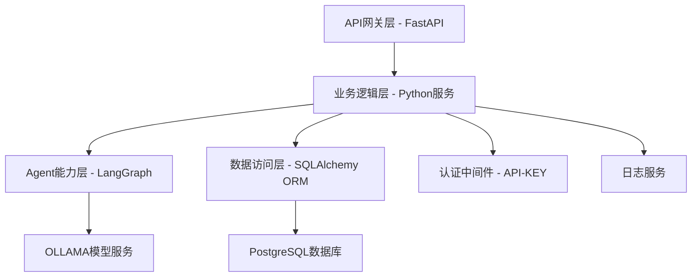
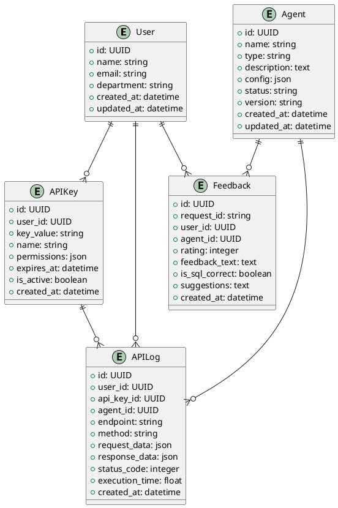

# 技术可行性分析报告

## 1. 文档信息

- 文档名称：技术可行性分析报告
- 编写人：malou
- 编写日期：2024-06-10
- 修订记录：
  - 2024-06-10：初稿
  - 2024-12-19：根据AI API接口平台具体需求完善技术可行性分析

## 2. 概述

### 2.1 分析目的
本技术可行性分析报告旨在评估AI API接口平台的技术实现方案，分析FastAPI+LangGraph+OLLAMA+PostgreSQL技术栈的可行性，识别技术风险和挑战，为项目决策提供技术依据。该平台将为财务部门提供统一的AI能力服务，重点支持自然语言转PSQL等核心功能。

### 2.2 分析范围
本分析涵盖API-KEY认证管理、自然语言转PSQL Agent、OLLAMA模型集成、PostgreSQL反馈数据存储等核心功能的技术可行性，以及系统架构、性能、安全、扩展性等方面的技术评估。

### 2.3 分析方法
采用技术调研、原型验证、风险评估、成本效益分析等方法，结合开源技术社区的最佳实践和成功案例，对技术方案进行全面评估。

## 3. 需求分析

### 3.1 功能需求
- **API-KEY认证管理**：支持API-KEY的生成、分发、验证、失效等全生命周期管理
- **自然语言转PSQL Agent**：接收自然语言输入，调用OLLAMA模型生成PostgreSQL查询语句
- **Agent能力注册与管理**：支持新AI Agent能力的注册、配置和管理
- **OLLAMA模型集成**：集成OLLAMA服务，支持llama3.2等模型的推理调用
- **反馈数据收集与存储**：收集用户使用反馈并存储到PostgreSQL数据库
- **RESTful API接口**：提供标准RESTful API接口，支持JSON格式数据交换
- **扩展能力预留**：支持后续根据业务需求新增其他AI Agent能力

### 3.2 性能需求
- **响应时间**：单次API调用响应时间≤2秒（不包括复杂SQL执行时间）
- **并发处理**：支持100+用户同时调用API接口
- **吞吐量**：支持每分钟1000+次API调用
- **模型推理**：OLLAMA模型调用响应时间≤5秒
- **系统可用性**：平台可用性≥99.9%

### 3.3 安全需求
- **身份认证**：所有API接口必须通过API-KEY认证
- **数据传输**：支持HTTPS加密传输
- **数据保护**：敏感数据加密存储，防止数据泄露
- **审计日志**：记录所有API调用和关键操作的审计日志

### 3.4 兼容性需求
- **协议兼容**：API接口符合RESTful规范
- **数据格式**：支持JSON格式数据交换
- **模型兼容**：支持OLLAMA框架下的多种模型
- **部署兼容**：支持容器化部署，兼容Kubernetes环境

## 4. 技术方案设计

### 4.1 总体架构
采用分层架构设计，包括API网关层、业务逻辑层、Agent能力层、数据访问层，确保各层职责清晰，便于维护和扩展。

### 4.2 技术选型
- **Web框架**：FastAPI（高性能、易扩展、自动生成API文档）
- **Agent框架**：LangGraph（专业的AI Agent编排框架）
- **模型服务**：OLLAMA（本地大模型推理服务，支持llama3.2等模型）
- **数据库**：PostgreSQL（成熟稳定的关系型数据库）
- **ORM框架**：SQLAlchemy（Python生态成熟的ORM框架）
- **认证机制**：API-KEY认证（简单高效的认证方式）

### 4.3 核心模块设计
#### 4.3.1 API-KEY认证模块
- **功能**：生成、验证、管理API-KEY
- **实现方案**：基于JWT或UUID生成唯一密钥，中间件拦截验证
- **技术要点**：密钥加密存储、过期时间控制、权限管理

#### 4.3.2 自然语言转PSQL Agent
- **功能**：将自然语言查询转换为PostgreSQL语句
- **实现方案**：基于LangGraph构建Agent工作流，调用OLLAMA模型进行NL2SQL转换
- **技术要点**：Prompt工程、模型微调、SQL语法验证、安全检查

#### 4.3.3 OLLAMA模型集成模块
- **功能**：调用本地OLLAMA模型进行推理
- **实现方案**：通过HTTP API调用OLLAMA服务，支持异步调用
- **技术要点**：连接池管理、超时控制、错误重试、负载均衡

#### 4.3.4 反馈数据管理模块
- **功能**：收集、存储、分析用户反馈数据
- **实现方案**：RESTful API收集反馈，ORM框架存储到PostgreSQL
- **技术要点**：数据验证、异步存储、统计分析、隐私保护

### 4.4 数据架构
采用PostgreSQL作为主数据库，设计合理的数据表结构，支持用户数据、Agent配置、API调用日志、反馈数据等的存储。

### 4.5 配置变更
- **新增配置项**：OLLAMA服务地址、模型配置参数、API-KEY加密密钥
- **数据库配置**：PostgreSQL连接参数、连接池配置
- **日志配置**：日志级别、输出格式、轮转策略
- **安全配置**：HTTPS证书、API限流参数

## 5. 关键技术分析

### 5.1 FastAPI框架可行性
**优势**：
- 高性能：基于Starlette和Pydantic，性能优异
- 易用性：自动生成OpenAPI文档，支持类型提示
- 异步支持：原生支持异步编程，适合I/O密集型应用
- 生态丰富：Python生态成熟，第三方库丰富

**技术成熟度**：★★★★★（非常成熟）
- 开源项目，社区活跃，文档完善
- 被众多企业在生产环境中使用
- 版本稳定，向后兼容性好

**实现难点**：
- 异步编程需要团队具备相关经验
- 性能优化需要深入理解异步机制

### 5.2 LangGraph Agent框架可行性
**优势**：
- 专业性：专门为AI Agent设计的编排框架
- 灵活性：支持复杂的工作流编排和状态管理
- 可视化：提供图形化的工作流设计界面
- 扩展性：易于扩展新的Agent能力

**技术成熟度**：★★★★☆（较成熟）
- LangChain生态的重要组成部分
- 社区活跃，持续更新
- 在AI应用中有较多成功案例

**实现难点**：
- 学习曲线较陡，需要理解Agent编程范式
- 调试和排错相对复杂
- 与OLLAMA集成需要定制开发

### 5.3 OLLAMA模型服务可行性
**优势**：
- 本地部署：数据安全，无需依赖外部服务
- 模型丰富：支持llama3.2、mistral等多种开源模型
- 性能优化：针对本地推理进行了优化
- 易于集成：提供标准HTTP API接口

**技术成熟度**：★★★★☆（较成熟）
- 开源项目，社区活跃
- 支持多种主流模型
- 部署简单，文档完善

**实现难点**：
- 需要GPU资源支持大模型推理
- 模型加载和推理速度需要优化
- 并发调用时的资源管理

### 5.4 PostgreSQL数据库可行性
**优势**：
- 成熟稳定：企业级数据库，稳定性高
- 功能丰富：支持JSON、全文检索等高级功能
- 性能优异：支持高并发，查询性能好
- 扩展性强：支持水平扩展和读写分离

**技术成熟度**：★★★★★（非常成熟）
- 开源数据库的首选
- 企业级应用广泛使用
- 生态完善，工具丰富

**实现难点**：
- 大数据量时需要考虑分库分表
- 备份恢复策略需要完善
- 性能调优需要专业知识

### 5.5 自然语言转PSQL技术难点
**核心挑战**：
- **语义理解**：准确理解用户的自然语言查询意图
- **SQL生成**：将自然语言转换为正确的PostgreSQL语句
- **语法验证**：确保生成的SQL语句语法正确且安全
- **上下文理解**：理解数据库表结构和业务上下文

**技术实现路径**：
1. **Prompt工程**：设计高质量的Prompt模板，提供数据库schema信息
2. **Few-shot学习**：提供典型的NL2SQL示例，提升模型理解能力
3. **SQL验证**：集成SQL解析器，验证生成语句的语法正确性
4. **安全检查**：防止SQL注入，限制危险操作

**可行性评估**：★★★★☆（较高）
- 基于大模型的NL2SQL技术已较成熟
- 开源社区有成功案例可参考
### 5.1 核心技术难点
- LangGraph与OLLAMA的深度集成
- 多租户数据隔离与权限控制
- 企业认证系统（OAuth2/SAML）对接的兼容性
- Agent能力的动态扩展与注册

### 5.2 技术实现路径
- 采用FastAPI标准化API开发，结合Pydantic实现数据校验
- 利用LangGraph实现Agent编排，封装与OLLAMA的接口
- 通过中间件实现API-KEY和企业认证双重认证
- 多租户通过数据库字段隔离+权限校验
- DIFY通过RESTful API对接

### 5.3 技术成熟度评估
- FastAPI、PostgreSQL、Docker等技术成熟度高
- LangGraph、OLLAMA为新兴组件，需重点验证兼容性和稳定性
- DIFY为开源前端平台，社区活跃，风险可控

### 5.4 技术风险评估
- LangGraph与OLLAMA集成存在不确定性
- 企业认证系统接口变更风险
- Agent能力动态扩展的安全性与稳定性

## 6. 资源可行性分析

### 6.1 人力资源
- 团队3-5人，具备Python、FastAPI、数据库、AI相关开发经验

### 6.2 时间资源
- 一期开发周期2个月，满足小需求开发节奏

## 7. 成本效益分析

### 7.1 开发成本
- 主要为人力成本，优先利用开源组件，降低技术投入

### 7.2 运维成本
- 容器化部署，便于环境管理和扩展，运维成本低

### 7.3 效益评估
- 提升AI服务可用性和扩展性，支持多业务部门快速集成
- 降低重复开发和维护成本

### 7.4 ROI分析
- 通过平台化建设，长期可节省大量AI能力对接和维护成本，投资回报率高

## 8. 风险评估与应对

| 风险类型   | 风险描述                         | 影响程度 | 概率 | 应对策略                         |
|------------|----------------------------------|----------|------|----------------------------------|
| 技术风险   | LangGraph与OLLAMA集成难度        | 高       | 中   | 早期原型验证，社区技术支持       |
| 技术风险   | 企业认证系统接口变更              | 中       | 中   | 采用标准协议，接口适配层         |
| 资源风险   | 团队人手不足                     | 中       | 低   | 灵活调配资源，阶段性目标拆解     |
| 时间风险   | 需求变更导致进度延误             | 中       | 中   | 敏捷开发，快速响应               |

## 9. 替代方案

### 9.1 备选技术方案
- 后端可选Django/FastAPI，最终选FastAPI
- Agent编排可选自研/采用LangGraph，优先LangGraph
- 本地推理可选OLLAMA/其他大模型框架，优先OLLAMA

### 9.2 方案对比
- FastAPI性能优于Django，开发效率高
- LangGraph可减少自研成本，提升Agent编排灵活性
- OLLAMA本地推理能力强，便于私有化部署

### 9.3 推荐方案
- 采用FastAPI+LangGraph+OLLAMA+PostgreSQL+DIFY的组合，兼顾性能、扩展性和开发效率

## 10. 结论与建议

### 10.1 可行性结论
- 该平台技术方案可行，关键技术均有成熟实现路径，风险可控

### 10.2 关键成功因素
- 早期完成LangGraph与OLLAMA集成原型
- 认证系统接口标准化
- 多租户与Agent能力的灵活扩展

### 10.3 实施建议
- 先行搭建最小可用原型，验证关键集成点
- 制定详细的接口和数据规范
- 加强安全和权限控制设计

### 10.4 后续行动
- 完成原型开发与集成测试
- 细化系统架构设计与开发计划
- 持续跟踪技术社区动态，及时调整方案

## 11. 附录

- 技术调研资料：FastAPI、LangGraph、OLLAMA、DIFY官方文档
- 原型验证结果：目前原型验证尚未完成，项目处于规划阶段，后续完成后将及时补充原型验证结果。
- 专家咨询意见：后续补充
- 相关技术文档链接：后续补充 