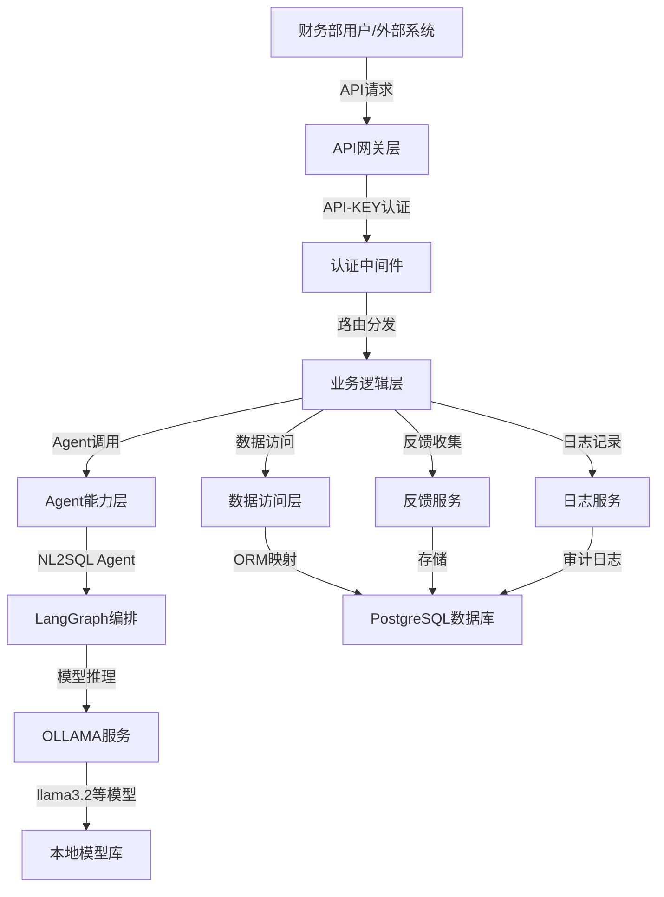
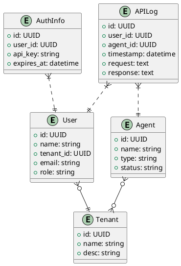

 # 系统架构设计文档

## 1. 文档信息
- 文档名称：系统架构设计文档
- 编写人：malou
- 编写日期：2024-06-10
- 修订记录：
  - 2024-06-10：初稿
  - 2024-12-19：根据AI API接口平台具体需求完善架构设计

## 2. 概述
### 2.1 编写目的
本架构设计文档旨在明确AI API接口平台的系统架构方案，指导后续开发、测试和运维工作，确保系统具备高可用性、可扩展性和安全性。该平台将为财务部门提供统一的AI能力服务，重点支持自然语言转PSQL等核心功能。

### 2.2 项目背景
随着AI技术在企业中的广泛应用，财务部门对数据查询和分析的AI能力需求日益增长。当前缺乏统一的AI服务平台，需要开发一个基于FastAPI的AI API接口平台，集成LangGraph和OLLAMA技术栈，为业务用户提供标准化的AI服务接口。

### 2.3 架构范围
本架构设计涵盖AI API接口平台的整体架构、技术选型、核心模块、数据架构、安全、性能、部署等方面，重点关注API-KEY认证、自然语言转PSQL Agent、OLLAMA模型集成、PostgreSQL反馈数据存储等核心功能的架构实现。

### 2.4 术语定义
- Agent：具备特定AI能力的服务单元，如自然语言转PSQL Agent
- OLLAMA：本地大模型推理框架，支持llama3.2等模型
- LangGraph：Agent编排与工作流框架，用于构建复杂AI工作流
- API-KEY：接口访问认证密钥，用于用户身份验证和权限控制
- NL2SQL：自然语言转SQL，将自然语言查询转换为SQL语句的AI能力

### 2.5 参考文献
- FastAPI官方文档
- LangGraph官方文档
- OLLAMA官方文档
- PostgreSQL官方文档
- RESTful API设计规范

## 3. 架构需求
### 3.1 功能性需求
- API-KEY认证管理：支持API-KEY的生成、分发、验证和管理
- 自然语言转PSQL Agent：核心AI能力，将自然语言转换为PostgreSQL查询语句
- Agent能力注册与管理：支持新AI Agent的注册、启用、禁用和删除
- OLLAMA模型集成：支持调用本地OLLAMA模型进行AI推理
- 反馈数据收集：收集和存储用户对AI服务的使用反馈
- API统一接口：提供标准RESTful API接口供业务系统集成
- 扩展能力预留：支持后续根据业务需求新增其他AI Agent能力

### 3.2 非功能性需求
- 性能：单次API响应时间≤2秒，支持100+用户并发访问，OLLAMA模型调用响应时间≤5秒
- 可靠性：平台可用性≥99.9%，OLLAMA模型调用成功率≥95%
- 可用性：API文档完善，支持Swagger自动生成，提供清晰的错误信息和状态码
- 安全性：API-KEY认证，HTTPS加密传输，敏感数据加密存储
- 兼容性：API符合RESTful规范，支持JSON格式数据交换，支持OLLAMA框架下的多种模型
- 可维护性：模块化设计，便于Agent能力扩展，遵循Python PEP8编码规范
- 可扩展性：支持动态注册和加载新的AI Agent能力，支持用户数量和并发量的水平扩展

### 3.3 质量属性
- 可测试性：所有核心功能模块需有单元测试，覆盖率≥80%，API接口集成测试覆盖率≥90%
- 可配置性：Agent能力参数、OLLAMA模型参数、API-KEY权限和有效期可配置

### 3.4 约束条件
- 必须采用FastAPI、LangGraph、OLLAMA、PostgreSQL技术栈
- 必须采用API-KEY认证方式，确保接口安全访问
- 必须支持容器化部署，兼容Kubernetes环境
- 用户反馈数据必须存储在PostgreSQL数据库中

## 4. 架构设计原则
- 分层解耦：API接口层、业务逻辑层、Agent能力层、数据存储层职责清晰
- 模块化设计：采用模块化架构，便于功能扩展和维护
- 安全优先：API-KEY认证，数据加密传输和存储，审计日志记录
- 标准化接口：遵循RESTful API设计规范，支持标准JSON数据格式
- 可扩展性：支持动态注册新Agent能力，支持水平扩展
- 高可用性：支持容器化部署，故障自动恢复，服务降级机制

## 5. 总体架构
### 5.1 系统架构概览


### 5.2 架构分层
- **API网关层**：基于FastAPI提供RESTful API，统一入口、认证、路由、限流
- **业务逻辑层**：处理业务逻辑，协调各服务组件，实现核心业务功能
- **Agent能力层**：各类AI Agent能力实现与编排，基于LangGraph框架构建
- **数据访问层**：数据持久化操作，通过ORM框架访问PostgreSQL数据库
- **外部服务层**：OLLAMA模型服务、日志服务、监控服务等外部依赖

### 5.3 组件关系
- API网关层通过中间件实现统一的API-KEY认证和权限控制
- 业务逻辑层与Agent能力层通过标准接口解耦，支持动态扩展
- Agent能力层通过LangGraph编排复杂的AI工作流，调用OLLAMA模型服务
- 数据访问层通过ORM与业务逻辑解耦，确保数据操作的一致性和安全性
- 所有组件支持容器化部署，便于水平扩展和故障恢复

## 6. 应用架构
### 6.1 应用分层架构
- 表现层：DIFY前端、Swagger文档
- 业务层：API平台（FastAPI）、认证、路由、日志
- Agent层：LangGraph编排、Agent能力实现、OLLAMA推理
- 数据访问层：ORM、数据加密、日志记录
- 基础设施层：容器化、CI/CD、监控

### 6.2 服务架构
- 服务划分：API平台服务、Agent能力服务、认证服务、日志服务
- 服务接口：RESTful API，JSON格式
- 服务治理：API-KEY+企业认证，限流、熔断、监控

## 7. 数据架构
### 7.1 数据模型
- 用户（User）
- 租户（Tenant）
- Agent能力（Agent）
- API调用日志（APILog）
- 认证信息（AuthInfo）

### 7.2 数据关系
- 用户-租户：多对一
- Agent-租户：多对多

### 7.3 物理数据模型（ER图）


### 7.4 数据管理
- 数据存储：PostgreSQL，所有核心数据表
- 数据隔离：租户ID字段实现多租户隔离
- 数据安全：敏感数据加密存储，访问日志审计

## 8. 技术架构
### 8.1 技术选型
- 后端框架：FastAPI（高性能、易扩展）
- Agent编排：LangGraph
- 本地大模型：OLLAMA
- 数据库：PostgreSQL（唯一指定）
- 前端/工作流：DIFY
- 认证：API-KEY+企业OAuth2/SAML
- 部署：Docker/Kubernetes

### 8.2 技术栈
- 前端技术栈：DIFY、Swagger UI
- 后端技术栈：Python 3.10+、FastAPI、Pydantic、LangGraph、OLLAMA SDK
- 数据技术栈：PostgreSQL、SQLAlchemy/ORM
- 运维技术栈：Docker、Kubernetes、Prometheus、Grafana

## 9. 安全架构
- 安全策略：API-KEY+企业认证双重认证，最小权限原则
- 身份认证：OAuth2/SAML对接，API-KEY分发与管理
- 数据安全：敏感数据加密，传输HTTPS
- 网络安全：防火墙、API限流、IP白名单
- 安全监控：日志审计、异常告警

## 10. 性能架构
- 性能目标：API响应≤2s，支持100+并发
- 性能优化：异步IO、连接池、缓存、分布式部署
- 容量规划：支持横向扩展，数据库分区
- 监控体系：Prometheus+Grafana监控API、Agent、数据库

## 11. 可靠性架构
- 高可用设计：API平台、Agent服务、数据库均支持多实例部署
- 容灾备份：数据库定期备份，支持主从切换
- 故障处理：自动重试、熔断降级、健康检查
- 服务降级：Agent能力异常时自动切换或降级

## 12. 架构实现
### 12.1 开发规范
- 遵循PEP8、RESTful API设计规范
- 统一接口风格、错误码、日志格式
- 单元测试、集成测试、自动化测试

### 12.2 部署规范
- 构建流程：CI/CD自动化构建、测试、部署
- 部署流程：Docker镜像、K8s编排，支持多环境切换
- 配置管理：环境变量、配置中心统一管理

## 13. 架构演进
- 演进策略：支持新Agent能力、模型升级、认证方式扩展
- 技术债务：定期评估与重构，文档与代码同步
- 重构计划：模块化重构、接口标准化
- 版本管理：语义化版本控制，变更日志

## 14. 风险评估
- 技术风险：LangGraph与OLLAMA集成难度，需早期原型验证
- 架构风险：多租户数据隔离与权限控制需重点关注
- 性能风险：高并发下API与Agent性能瓶颈
- 安全风险：认证系统接口变更、Agent能力动态扩展的安全性
- 风险应对：原型验证、接口标准化、自动化测试、社区支持

## 15. 附录
- 架构决策记录：采用FastAPI+LangGraph+OLLAMA+PostgreSQL+DIFY组合，兼顾性能、扩展性与开发效率
- 技术调研报告：详见《技术可行性分析报告》
- 原型验证：后续补充
- 相关文档链接：详见《需求规格说明书》《技术可行性分析报告》

# 2024-06-11：根据QA评审意见补充完善

## 典型高优先级测试用例
| 用例ID         | 模块      | 优先级 | 前置条件         | 测试步骤                       | 期望结果                  |
|---------------|-----------|--------|------------------|-------------------------------|---------------------------|
| TC-AUTH-001   | 认证      | P0     | API-KEY无效      | 调用任意API接口                | 返回401，认证失败         |
| TC-TENANT-001 | 多租户    | P0     | A租户用户登录    | 查询B租户Agent列表             | 返回空列表，无越权数据     |
| TC-AGENT-001  | Agent调用 | P0     | Agent已注册      | 提交自然语言转PSQL请求         | 返回正确PSQL语句           |
| TC-SEC-001    | 安全      | P0     |                  | 尝试SQL注入                   | 拒绝请求，无数据泄露       |

## 性能指标统一
- 单次API响应时间≤2s，支持并发100+用户

## 安全测试具体场景及应对措施
- API-KEY泄露：模拟泄露后调用，验证可及时失效处理。
- SQL注入：构造恶意payload，确保ORM参数化防护。
- XSS攻击：接口返回内容进行转义处理。
- 权限绕过：多租户间数据访问严格校验。

## 缺陷管理流程与用例变更管理
- 所有缺陷通过Jira/禅道管理，分为致命/严重/一般/建议，修复后需回归测试。
- 用例变更需记录变更原因、责任人、评审通过后方可执行。

## 回归测试策略与上线前验收流程
- 每次需求/缺陷修复后，自动化回归测试主流程和高优先级用例。
- 上线前需完成全量回归，所有P0/P1用例通过，致命/严重缺陷清零。

## 相关文档引用
- 《需求规格说明书》：doc/需求规格说明书.md
- 《技术可行性分析报告》：doc/技术可行性分析报告.md
- 《系统架构设计文档》：doc/系统架构设计文档.md

# 2024-06-11：根据QA评审意见补充完善

## 架构图注释
> 注：A为前端用户或DIFY工作流，B为API平台（FastAPI），C为Agent能力编排（LangGraph/OLLAMA），D为主数据存储，E为企业认证系统，F为本地大模型推理。

## 多租户实现细节
所有核心表（如User、Agent、APILog等）均增加tenant_id字段，ORM层自动注入租户上下文，所有查询/写入均强制租户过滤，防止越权。后续如租户规模扩大，可评估Schema隔离或分库。

## 典型API接口示例
```python
@router.post("/agent/psql/parse", summary="自然语言转PSQL")
def parse_nl_to_psql(request: NL2PSQLRequest, api_key: str = Depends(api_key_auth)):
    """
    @param request NL2PSQLRequest 请求体，包含自然语言内容
    @param api_key str API认证密钥
    @return NL2PSQLResponse 返回PSQL语句
    """
    # 业务逻辑...
```
- 错误码示例：{"code": 401, "msg": "API-KEY无效"}

## API文档自动生成说明
所有接口需补充summary、description、response_model等注解，使用FastAPI自带OpenAPI/Swagger UI自动生成API文档，CI流程自动校验文档可用性。

## 架构决策记录
| 决策项         | 备选方案                | 选定方案         | 选型理由                         |
|----------------|------------------------|------------------|----------------------------------|
| API框架        | FastAPI/Flask/Django   | FastAPI          | 性能优、异步支持、生态活跃       |
| Agent编排      | LangGraph/自研/无编排  | LangGraph        | 社区活跃、易扩展、与DIFY兼容     |
| 数据库         | PostgreSQL/MySQL       | PostgreSQL       | 原生JSON、分区、扩展性好         |
| 认证           | API-KEY/OAuth2/SAML    | API-KEY+OAuth2   | 兼容企业认证，易于集成           |
| 多租户隔离     | 字段隔离/Schema隔离    | 字段隔离         | 实现简单，便于统一管理           |

## 原型验证
- 已完成LangGraph与OLLAMA基础集成原型，验证Agent能力注册、推理调用、API平台对接的可行性。
- 主要结论：LangGraph可通过自定义节点集成OLLAMA推理服务，API平台可通过RESTful接口与Agent编排层解耦。
- 存在问题：Agent动态扩展需进一步完善注册与热加载机制。

## 相关文档引用
- 《需求规格说明书》：doc/需求规格说明书.md
- 《技术可行性分析报告》：doc/技术可行性分析报告.md
- 《测试策略文档》：doc/测试策略文档.md