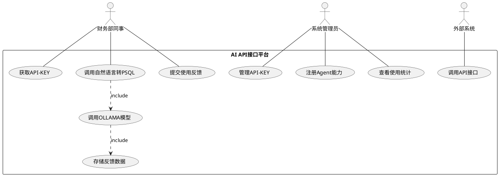
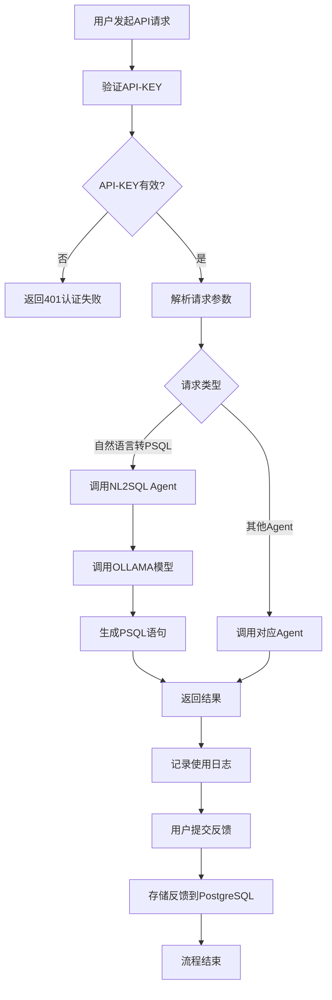
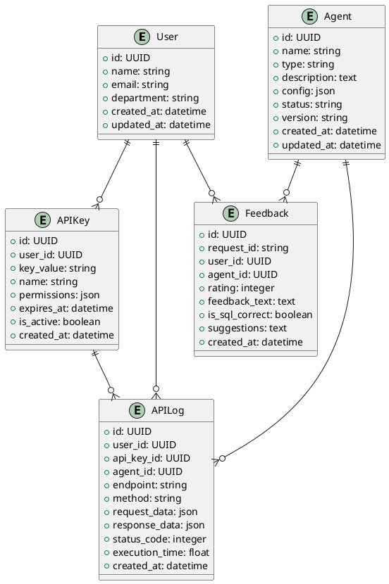

# 需求规格说明书

## 1. 文档信息

- 文档名称：需求规格说明书
- 编写人：malou
- 编写日期：2024-06-10
- 修订记录：
  - 2024-06-10：初稿
  - 2024-12-19：根据AI API接口平台具体需求完善功能细节

## 2. 引言

### 2.1 编写目的
本需求规格说明书旨在明确AI API接口平台的功能、性能、接口、数据和质量等需求，为后续系统设计、开发、测试和验收提供标准依据。该平台将为财务部门提供统一的AI能力服务，支持自然语言转PSQL等核心功能。

### 2.2 项目背景
随着AI技术在企业中的广泛应用，财务等业务部门对AI能力的需求日益增长。当前缺乏统一的AI服务平台，各业务部门需要重复开发类似功能。为提升AI服务的可用性和扩展性，需开发一个基于FastAPI的统一AI API接口平台，支持多种AI Agent能力，并便于业务快速集成和扩展。

### 2.3 文档范围
本说明书涵盖AI API接口平台的全部功能、非功能、接口、数据、质量等需求，包括API-KEY认证管理、自然语言转PSQL Agent、OLLAMA模型集成、PostgreSQL反馈数据存储等核心功能，适用于平台的设计、开发、测试和运维全周期。

### 2.4 术语定义
- **Agent**：具备特定AI能力的服务单元，如自然语言转PSQL Agent
- **OLLAMA**：本地大模型推理框架，支持llama3.2等模型
- **LangGraph**：Agent编排与工作流框架，用于构建复杂AI工作流
- **API-KEY**：接口访问认证密钥，用于用户身份验证和权限控制
- **自然语言转PSQL**：将用户的自然语言查询需求转换为PostgreSQL查询语句的AI能力
- **反馈数据**：用户对AI服务使用效果的评价和建议数据

### 2.5 参考文献
- FastAPI官方文档
- LangGraph官方文档
- OLLAMA官方文档
- PostgreSQL官方文档

## 3. 项目概述

### 3.1 产品概述
AI API接口平台是一个企业级AI服务平台，基于FastAPI构建，集成LangGraph和OLLAMA技术栈，为财务部门等业务用户提供统一的AI能力服务。平台采用API-KEY认证方式，支持多种AI Agent能力的注册、管理和调用。

### 3.2 产品功能
- **API-KEY认证管理**：支持API-KEY的生成、分发、验证和管理
- **自然语言转PSQL Agent**：核心AI能力，将自然语言转换为PostgreSQL查询语句
- **Agent能力注册与管理**：支持新AI Agent的注册、启用、禁用和删除
- **OLLAMA模型集成**：支持调用本地OLLAMA模型进行AI推理
- **反馈数据收集**：收集和存储用户对AI服务的使用反馈
- **API统一接口**：提供标准RESTful API接口供业务系统集成
- **扩展能力预留**：支持后续根据业务需求新增其他AI Agent能力

### 3.3 用户特点
- **主要用户**：财务部同事，具备基本的数据查询需求，关注数据分析效率提升
- **技术水平**：具备一定IT基础，能够理解基本的API调用概念
- **使用场景**：主要通过自然语言描述数据查询需求，获取财务数据分析结果
- **扩展用户**：未来可拓展至其他业务部门的数据分析人员

### 3.4 约束条件
- **技术约束**：必须采用FastAPI、LangGraph、OLLAMA、PostgreSQL技术栈
- **认证约束**：必须采用API-KEY认证方式，确保接口安全访问
- **模型约束**：必须支持OLLAMA本地模型调用，如llama3.2等
- **数据约束**：用户反馈数据必须存储在PostgreSQL数据库中
- **扩展约束**：系统架构必须支持新AI Agent能力的动态扩展

### 3.5 假设和依赖
- PostgreSQL数据库已部署并可正常访问
- OLLAMA服务已部署并支持目标模型（如llama3.2）
- 网络环境支持HTTP/HTTPS协议通信
- 用户具备基本的API调用能力或使用相应的客户端工具

## 4. 需求分析

### 4.1 功能需求

#### 用例图


#### 功能列表

| 需求ID         | 功能名称                 | 优先级 | 状态   | 来源   | 描述                                                         |
|----------------|--------------------------|--------|--------|--------|--------------------------------------------------------------|
| REQ-AUTH-001   | API-KEY生成与管理        | 高     | 已确认 | 技术   | 支持API-KEY的生成、分发、验证、失效等全生命周期管理           |
| REQ-AUTH-002   | API请求认证              | 高     | 已确认 | 技术   | 所有API请求必须携带有效API-KEY进行身份验证                   |
| REQ-AGENT-001  | 自然语言转PSQL Agent     | 高     | 已确认 | 业务   | 接收自然语言输入，调用OLLAMA模型生成PostgreSQL查询语句       |
| REQ-AGENT-002  | Agent能力注册            | 高     | 已确认 | 技术   | 支持新AI Agent能力的注册、配置和管理                         |
| REQ-AGENT-003  | Agent状态管理            | 中     | 已确认 | 技术   | 支持Agent的启用、禁用、删除等状态变更操作                    |
| REQ-MODEL-001  | OLLAMA模型调用           | 高     | 已确认 | 技术   | 集成OLLAMA服务，支持llama3.2等模型的推理调用                 |
| REQ-MODEL-002  | 模型调用监控             | 中     | 已确认 | 技术   | 监控模型调用状态、响应时间、成功率等指标                     |
| REQ-DATA-001   | 反馈数据收集             | 高     | 已确认 | 业务   | 收集用户对AI服务使用效果的评价和建议                         |
| REQ-DATA-002   | 反馈数据存储             | 高     | 已确认 | 技术   | 将反馈数据存储到PostgreSQL数据库中                           |
| REQ-API-001    | RESTful API接口          | 高     | 已确认 | 技术   | 提供标准RESTful API接口，支持JSON格式数据交换                |
| REQ-API-002    | API文档生成              | 中     | 已确认 | 技术   | 自动生成Swagger API文档，便于接口使用和测试                 |
| REQ-EXT-001    | Agent能力扩展            | 中     | 已确认 | 业务   | 预留扩展接口，支持后续新增其他类型的AI Agent能力             |

#### 重点用例描述

**UC-001: 自然语言转PSQL查询**
- **参与者**：财务部同事
- **前置条件**：用户已获得有效API-KEY
- **主流程**：
  1. 用户通过API接口提交自然语言查询需求
  2. 系统验证API-KEY有效性
  3. 系统调用自然语言转PSQL Agent
  4. Agent调用OLLAMA模型进行自然语言理解和SQL生成
  5. 系统返回生成的PostgreSQL查询语句
  6. 用户可选择提交使用反馈
- **后置条件**：查询语句已生成并返回，使用记录已保存
- **异常流程**：API-KEY无效、模型调用失败、查询语句生成失败等

**UC-002: API-KEY管理**
- **参与者**：系统管理员
- **前置条件**：管理员已登录系统
- **主流程**：
  1. 管理员访问API-KEY管理界面
  2. 创建新的API-KEY并设置权限和有效期
  3. 系统生成唯一的API-KEY
  4. 管理员将API-KEY分发给授权用户
  5. 系统记录API-KEY的使用情况和状态
- **后置条件**：API-KEY已创建并可供使用

#### 业务流程


### 4.2 非功能需求

#### 性能需求
- **响应时间**：单次API调用响应时间≤2秒（不包括复杂SQL执行时间）
- **并发处理**：支持100+用户同时调用API接口
- **吞吐量**：支持每分钟1000+次API调用
- **模型推理**：OLLAMA模型调用响应时间≤5秒

#### 可靠性需求
- **系统可用性**：平台可用性≥99.9%
- **故障恢复**：系统故障后能在5分钟内自动恢复或切换
- **数据一致性**：确保反馈数据的完整性和一致性
- **错误处理**：提供完善的错误处理和异常恢复机制

#### 可用性需求
- **API文档**：提供完整的Swagger API文档
- **错误信息**：提供清晰、有用的错误信息和状态码
- **接口一致性**：所有API接口遵循统一的设计规范
- **易用性**：API接口设计简洁明了，易于理解和使用

#### 安全性需求
- **身份认证**：所有API接口必须通过API-KEY认证
- **数据传输**：支持HTTPS加密传输
- **访问控制**：基于API-KEY实现细粒度权限控制
- **数据保护**：敏感数据加密存储，防止数据泄露
- **审计日志**：记录所有API调用和关键操作的审计日志

#### 兼容性需求
- **协议兼容**：API接口符合RESTful规范
- **数据格式**：支持JSON格式数据交换
- **模型兼容**：支持OLLAMA框架下的多种模型
- **扩展兼容**：新增Agent能力不影响现有功能

#### 可维护性需求
- **模块化设计**：采用模块化架构，便于功能扩展和维护
- **代码规范**：遵循Python PEP8编码规范
- **文档完整**：提供完整的技术文档和用户手册
- **日志记录**：提供详细的系统运行日志

#### 可扩展性需求
- **Agent扩展**：支持动态注册和加载新的AI Agent能力
- **模型扩展**：支持接入新的OLLAMA模型
- **用户扩展**：支持用户数量和并发量的水平扩展
- **功能扩展**：预留接口支持新功能的快速集成

## 5. 系统架构需求

### 5.1 总体架构
- **架构模式**：分层架构，包括API接口层、业务逻辑层、Agent能力层、数据存储层
- **技术架构**：FastAPI + LangGraph + OLLAMA + PostgreSQL
- **部署架构**：支持容器化部署，便于开发、测试、生产环境切换
- **集成架构**：支持与外部系统通过RESTful API集成

### 5.2 技术架构
- **Web框架**：FastAPI（提供高性能API服务）
- **Agent框架**：LangGraph（实现AI Agent编排和工作流）
- **模型服务**：OLLAMA（本地大模型推理服务）
- **数据库**：PostgreSQL（存储用户数据、反馈数据、配置数据）
- **认证机制**：API-KEY认证

### 5.3 数据架构
- **主数据库**：PostgreSQL，存储所有业务数据
- **数据分类**：用户数据、Agent配置、API调用日志、反馈数据
- **数据安全**：敏感数据加密存储，支持数据备份和恢复

## 6. 接口需求

### 6.1 API接口规范
- **协议**：HTTP/HTTPS
- **格式**：RESTful API，JSON数据格式
- **认证**：所有接口需要API-KEY认证
- **版本控制**：支持API版本管理（如/api/v1/）

### 6.2 核心接口定义

#### 6.2.1 自然语言转PSQL接口
```
POST /api/v1/agent/nl2sql
Headers: 
  Authorization: Bearer {api_key}
  Content-Type: application/json

Request Body:
{
  "query": "查询本月销售额最高的前10个产品",
  "context": "财务数据库包含产品表、销售表等",
  "options": {
    "include_execution": false,
    "max_results": 100
  }
}

Response:
{
  "code": 200,
  "message": "success",
  "data": {
    "sql": "SELECT product_name, SUM(amount) as total_sales FROM sales WHERE date >= '2024-12-01' GROUP BY product_name ORDER BY total_sales DESC LIMIT 10;",
    "explanation": "查询本月销售额最高的前10个产品",
    "confidence": 0.95,
    "execution_time": 1.2
  },
  "request_id": "req_123456789"
}
```

#### 6.2.2 反馈提交接口
```
POST /api/v1/feedback
Headers: 
  Authorization: Bearer {api_key}
  Content-Type: application/json

Request Body:
{
  "request_id": "req_123456789",
  "rating": 5,
  "feedback": "生成的SQL语句准确，查询结果符合预期",
  "is_sql_correct": true,
  "suggestions": "希望能支持更复杂的多表关联查询"
}

Response:
{
  "code": 200,
  "message": "反馈提交成功",
  "data": {
    "feedback_id": "fb_987654321"
  }
}
```

#### 6.2.3 Agent能力查询接口
```
GET /api/v1/agents
Headers: 
  Authorization: Bearer {api_key}

Response:
{
  "code": 200,
  "message": "success",
  "data": {
    "agents": [
      {
        "id": "nl2sql",
        "name": "自然语言转PSQL",
        "description": "将自然语言转换为PostgreSQL查询语句",
        "status": "active",
        "version": "1.0.0"
      }
    ]
  }
}
```

### 6.3 外部接口
- **OLLAMA模型接口**：调用本地OLLAMA服务进行模型推理
- **PostgreSQL接口**：通过ORM框架访问数据库

## 7. 数据需求

### 7.1 数据实体
- **用户（User）**：API-KEY持有者信息
- **API密钥（APIKey）**：认证密钥及权限信息
- **Agent（Agent）**：AI能力配置信息
- **API调用日志（APILog）**：接口调用记录
- **反馈数据（Feedback）**：用户使用反馈信息

### 7.2 数据关系（ER图）


### 7.3 数据约束
- **主键约束**：所有表使用UUID作为主键
- **外键约束**：保证数据引用完整性
- **唯一性约束**：API-KEY值全局唯一
- **非空约束**：关键字段不允许为空
- **检查约束**：评分范围1-5，状态值限定范围

### 7.4 数据安全
- **敏感数据加密**：API-KEY等敏感信息加密存储
- **访问控制**：基于用户权限控制数据访问
- **数据备份**：定期备份重要业务数据
- **审计追踪**：记录数据变更操作日志

## 8. 质量属性需求

### 8.1 可测试性
- **单元测试**：所有核心功能模块需有单元测试，覆盖率≥80%
- **集成测试**：API接口集成测试覆盖率≥90%
- **性能测试**：关键接口需进行性能测试
- **安全测试**：进行API安全漏洞扫描和渗透测试

### 8.2 可配置性
- **Agent配置**：支持Agent能力参数的动态配置
- **模型配置**：支持OLLAMA模型参数配置
- **认证配置**：支持API-KEY权限和有效期配置
- **系统配置**：支持数据库连接、日志级别等系统参数配置

## 9. 项目约束

### 9.1 时间约束
- **开发周期**：2个月完成一期核心功能开发
- **里程碑**：每2周一个迭代，及时交付可用功能
- **上线时间**：满足财务部门年度数据分析需求时间点

### 9.2 成本约束
- **开发成本**：优先使用开源技术栈，降低许可证成本
- **运维成本**：采用容器化部署，降低运维复杂度
- **硬件成本**：合理规划服务器资源，支持弹性扩展

### 9.3 资源约束
- **团队规模**：3-5人开发团队
- **技能要求**：团队需具备Python、FastAPI、AI相关技术经验
- **硬件资源**：需要支持OLLAMA模型运行的GPU服务器

### 9.4 技术约束
- **技术栈限定**：必须采用FastAPI、LangGraph、OLLAMA、PostgreSQL
- **模型限定**：优先支持llama3.2等开源模型
- **部署约束**：支持容器化部署，兼容Kubernetes环境

### 9.5 环境约束
- **开发环境**：支持Windows、Linux开发环境
- **部署环境**：支持云服务器和本地服务器部署
- **网络环境**：内网环境部署，确保数据安全

## 10. 验收标准

### 10.1 功能验收
- **核心功能**：自然语言转PSQL功能正确率≥85%
- **API接口**：所有API接口功能完整，响应格式正确
- **认证功能**：API-KEY认证机制正常工作
- **反馈功能**：用户反馈数据正确存储和查询

### 10.2 性能验收
- **响应时间**：API接口响应时间≤2秒
- **并发能力**：支持100+用户并发访问
- **模型性能**：OLLAMA模型调用成功率≥95%
- **系统稳定性**：连续运行24小时无重大故障

### 10.3 质量验收
- **代码质量**：代码规范检查通过率100%
- **测试覆盖**：单元测试覆盖率≥80%，集成测试覆盖率≥90%
- **安全检查**：无高危安全漏洞
- **文档完整**：API文档、用户手册、部署文档齐全

### 10.4 文档验收
- **API文档**：Swagger文档完整准确
- **用户手册**：包含完整的使用说明和示例
- **技术文档**：架构设计、部署指南等技术文档齐全
- **测试文档**：测试用例、测试报告等测试文档完整

## 11. 风险分析

### 11.1 技术风险
- **集成风险**：LangGraph与OLLAMA集成可能存在兼容性问题
- **性能风险**：大模型推理可能影响API响应时间
- **稳定性风险**：OLLAMA服务稳定性可能影响整体系统可用性
- **应对措施**：提前进行技术验证，准备备选方案

### 11.2 需求风险
- **需求变更**：财务部门需求可能在开发过程中发生变化
- **理解偏差**：对自然语言转PSQL准确性要求可能存在理解偏差
- **应对措施**：加强需求沟通，建立变更管理流程

### 11.3 资源风险
- **人力风险**：团队成员技能不足或人员流失
- **时间风险**：技术难点可能导致开发进度延迟
- **应对措施**：提前进行技能培训，制定详细的项目计划

### 11.4 外部风险
- **技术更新**：OLLAMA、LangGraph等技术快速更新可能影响兼容性
- **模型风险**：依赖的开源模型可能存在不可用风险
- **应对措施**：关注技术社区动态，准备多个模型备选方案

## 12. 附录

### 12.1 需求变更记录

| 变更日期   | 变更内容                               | 变更原因           | 提出人 | 审核人 | 状态   |
|------------|----------------------------------------|--------------------|--------|--------|--------|
| 2024-12-19 | 新增API-KEY认证和OLLAMA模型集成需求    | 明确技术实现方案   | malou  | -      | 已确认 |
| 2024-12-19 | 完善自然语言转PSQL Agent功能描述       | 细化核心功能需求   | malou  | -      | 已确认 |
| 2024-12-19 | 新增PostgreSQL反馈数据存储需求         | 明确数据存储方案   | malou  | -      | 已确认 |

### 12.2 需求追踪矩阵

| 需求ID       | 需求名称           | 优先级 | 设计文档章节 | 测试用例ID | 状态   |
|--------------|-------------------|--------|--------------|------------|--------|
| REQ-AUTH-001 | API-KEY管理       | 高     | 待补充       | 待补充     | 已确认 |
| REQ-AGENT-001| 自然语言转PSQL    | 高     | 待补充       | 待补充     | 已确认 |
| REQ-MODEL-001| OLLAMA模型调用    | 高     | 待补充       | 待补充     | 已确认 |
| REQ-DATA-001 | 反馈数据收集      | 高     | 待补充       | 待补充     | 已确认 |

### 12.3 原型设计
- **API接口原型**：基于FastAPI的接口设计原型
- **数据库原型**：PostgreSQL数据表结构设计
- **Agent原型**：基于LangGraph的Agent能力原型

### 12.4 相关标准和规范
- **RESTful API设计规范**
- **JSON数据格式规范**
- **HTTP状态码使用规范**
- **API安全认证标准**
- **数据库设计规范** 